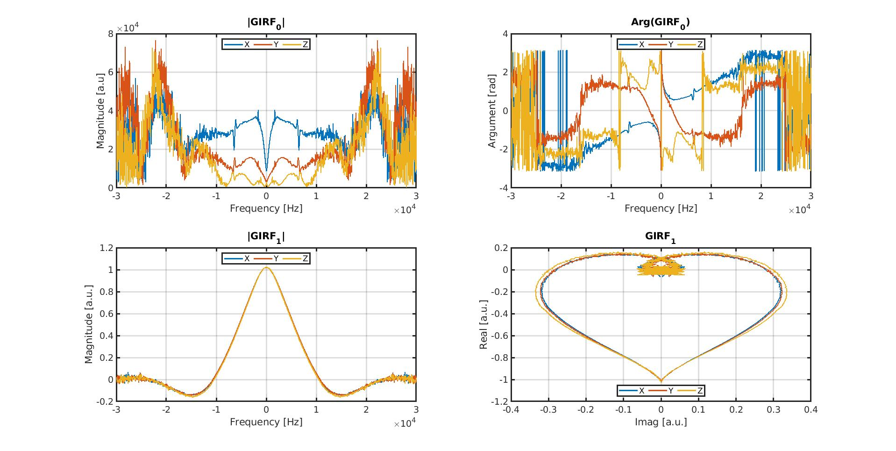

**These script reproduce some of the work shown in the article:**

T. Bruijnen, B. Stemkens, C.A.T. van den Berg and R.H.N. Tijssen.
"Prospective GIRF-based RF phase cycling to reduce eddy current-induced steady-state disruption in bSSFP imaging."

The files contain matlab code **1)** to process gradient measurements from k-space data; **2)** to calculate gradient impulse response functions and **3)** to simulate eddy current-induced steady-state disruption using bloch equations. In addition we provide a freely available set of gradient impulse response functions. The three figures below summarize these three functionalities respectively.

**Figure 1**

**Figure 2**

### References

[1] Jeff H. Duyn,Yihong Yang, Joseph A. Frank, and Jan Willem van der Veen.
"Simple Correction Method for k-Space Trajectory Deviations in MRI"

[2] Ethan K. Brodsky, Jessica L. Klaers, Alexey A. Samsonov,Richard Kijowski and Walter F. Block.
"Rapid Measurement and Correction of Phase Errors from B0 Eddy Currents: Impact on Image Quality for Non-Cartesian Imaging"

[3] Signe J. Vannesjo,Maximilan Haeberlin,Lars Kasper,Matteo Pavan,Bertram J. Wilm,Christoph Barmet,Klaas P. Pruessmann.
"Gradient system characterization by impulse response measurements with a dynamic field camera"

[4] Brian Hargreaves's Bloch simulation code
http://mrsrl.stanford.edu/~brian/blochsim/

For questions or suggestions please contact me @ t.bruijnen@umcutrecht.nl.
